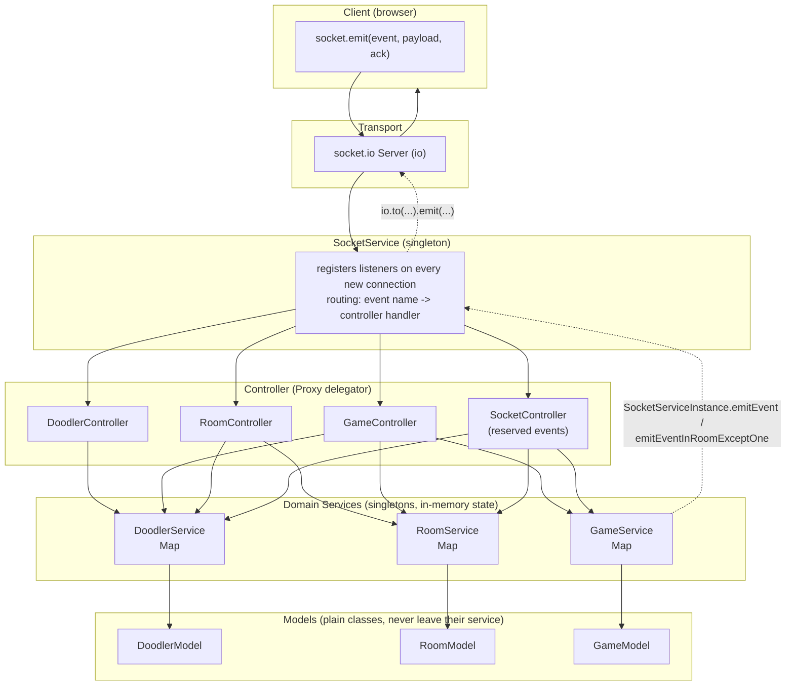
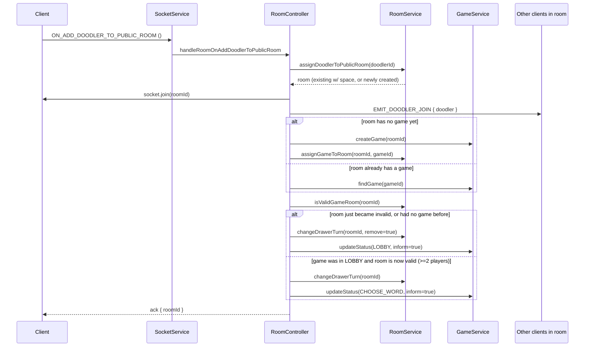
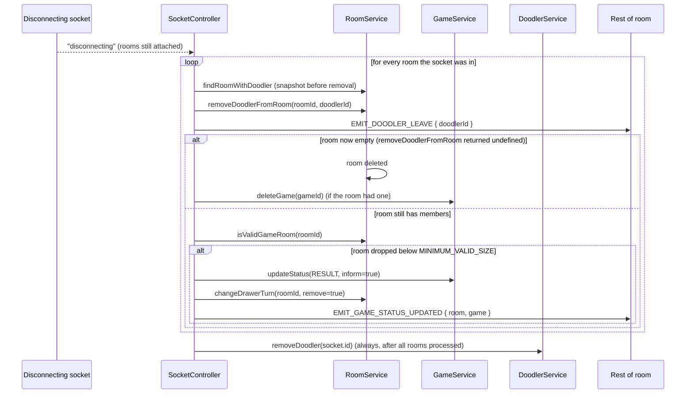

# Doodle Server — Architecture Documentation

This document describes the architecture of `doodle-server`: every module, service,
controller, model, event, type, and utility, and how they fit together. It is meant
to be the single reference for understanding the backend without having to read the
whole source tree first.

## 1. What this service is

`doodle-server` is the real-time backend for a Skribbl.io-style "draw and guess" game
("Doodle"). A player ("doodler") joins a room (public or private), players take turns
drawing a secret word on a shared canvas while everyone else tries to guess it in a
chat-like "hunch" box, and the game scores guesses by how quickly they were made.

There is no HTTP API and no database. The server is a single Socket.IO server:
Express is only used to host the HTTP server that Socket.IO attaches to (for CORS
preflight / upgrade handling), and all real work happens over WebSocket events. All
state (doodlers, rooms, games) lives **in-process, in memory**, in JavaScript `Map`s —
there is no persistence layer. Restarting the process wipes all rooms and games.

## 2. Tech stack

| Concern | Choice |
|---|---|
| Language | TypeScript (strict mode), compiled with `tsc` |
| HTTP server | Express 4 (CORS + house for the raw `http.Server`) |
| Realtime transport | `socket.io` 4 (server) |
| ID generation | `nanoid` (10-char lowercase-alphanumeric IDs) |
| Path aliasing | `@/*` → `src/*` at dev time (`tsconfig-paths`), `@` → `dist` at runtime (`module-alias`) |
| Process config | `dotenv` (`.env`, `.env.production`) |
| Lint/format | ESLint (`simple-import-sort`, `import`, `@typescript-eslint`) + Prettier |
| Commit hygiene | `commitlint` with `@commitlint/config-conventional` |
| Containerization | Docker (`node:23-alpine`), exposes port `5000` |

Scripts (`package.json`):
- `npm run dev` — `nodemon` + `ts-node` with path-alias resolution, watches `src/**/*`.
- `npm run build` — `tsc` to `dist/`.
- `npm start` — builds, then runs `dist/app.js` with `module-alias` registered.
- `npm run lint` / `lint:fix` — ESLint over the project.
- `npm run format` — Prettier over `src/**/*.{js,ts}`.
- `test` is a stub (`echo "Error: no test specified"`) — **there is no test suite**.

## 3. Directory layout

```
src/
  app.ts                        Process entry point: Express app, http server, Socket.IO server, CORS
  constants/
    game.ts                     Game tuning constants + DEFAULT_GAME_OPTIONS
    events/socket.ts            All Socket.IO event name enums
    words.json                  2307 [word, length] pairs used as the guessable word bank
  controllers/
    index.ts                    Controller — Proxy-based delegator over the 4 sub-controllers
    internal/socket/            Handles Socket.IO *reserved* events (connect/disconnect/error)
    internal/doodler/           Handles doodler profile get/set
    internal/room/              Handles room join/create/get
    internal/game/              Handles gameplay events (canvas, word choice, hunches, private game)
  services/
    socket/SocketService.ts     Owns the `io` instance; registers all event listeners; emits events
    doodler/DoodlerService.ts   In-memory doodler registry (Map<socketId, DoodlerModel>)
    room/RoomService.ts         In-memory room registry (Map<roomId, RoomModel>)
    game/GameService.ts         In-memory game registry (Map<gameId, GameModel>) + game state machine
  models/
    DoodlerModel.ts             Internal doodler entity (id, name, avatar, score)
    RoomModel.ts                Internal room entity (members, owner, drawer, capacity, game link)
    GameModel.ts                Internal game entity (status, options, timers, canvas stack, hunches)
  types/
    game.ts                     GameStatus, GameOptions, CanvasOperation/Action, Coordinate, map types
    service.ts                  Generic ServiceResponse<T> envelope (data/error)
    socket/                     Per-domain Socket.IO payload contracts + the merged event typings
      doodler.ts, game.ts, room.ts, helper.ts, index.ts
  utils/
    error.ts                    DoodleServerError — the only error type sent to clients
    game.ts                     createHunch(), hideWord() helpers
    service.ts                  SuccessResponse()/ErrorResponse() envelope helpers (currently unused by controllers)
    stack.ts                    Generic Stack<T> with "undo-preserving" pop/unpop semantics
    unique.ts                   generateId() — 10-char nanoid generator
    words.ts                    fetchRandomWords(n) — samples the word bank
```

## 4. Layered architecture

The codebase follows a strict **Controller → Service → Model** layering, repeated
per domain (Socket, Doodler, Room, Game):



Key rules enforced by the code:

- **Models are private to their service.** Every model file's docblock says
  *"FOR USE INSIDE `<X>` SERVICE ONLY — TO SEND DATA TO CLIENT OR ANOTHER SERVICE,
  USE `<X>` INTERFACE INSTEAD"*. Each model exposes a `.json` getter that produces
  the plain-object "Interface" shape (`DoodlerInterface`, `RoomInterface`,
  `GameInterface`) — that's the only thing that ever crosses a service boundary.
- **Services are singletons.** Each service file instantiates itself once at module
  load (`const XServiceInstance = new XService(); export default XServiceInstance;`)
  and every consumer imports that instance. There is no DI container — cross-service
  calls just import the other singleton directly (e.g. `GameService` imports
  `RoomServiceInstance`, `DoodlerServiceInstance`, `SocketServiceInstance`).
- **Controllers are stateless request handlers.** A controller method is a curried
  function `(socket) => (payload, respond) => {...}` — it captures the socket, then
  returns the actual Socket.IO listener. Controllers only orchestrate calls to
  services; they hold no state themselves.
- **All async, all awaited.** Every service method returns a `Promise`, even for
  synchronous `Map` operations — this keeps the calling convention uniform and
  makes future persistence-layer swaps (e.g. a real DB) a non-breaking change.

### 4.1 The `Controller` delegator (`src/controllers/index.ts`)

`Controller` is not a real controller; it's a `Proxy` that fans out property access
to four private sub-controller instances (`SocketController`, `DoodlerController`,
`RoomController`, `GameController`):

- On `get`, it first checks if the property exists on `Controller` itself (it never
  does, besides the constructor), then linearly searches the four sub-controllers.
- If the found property is a function, it is **rebound** to its owning sub-controller
  (`property.bind(ctrl)`) before being returned, so `this` inside a handler always
  refers to the correct sub-controller instance.
- This lets `SocketService` call `this._controller.handleGameOnChooseWord(...)` etc.
  as if `Controller` implemented the union of all four interfaces
  (`ControllerInterface = SocketControllerInterface & DoodlerControllerInterface &
  RoomControllerInterface & GameControllerInterface`), without an explicit switch
  statement or manual re-export of every method.

### 4.2 `SocketService` — the transport/routing layer

`SocketService` (singleton) is the only place that touches the raw `io`/`socket`
objects outside of controllers. Responsibilities:

1. **`start(io)`** — called once from `app.ts`. Stores `io`, and on every new
   `connection` registers four groups of listeners for that socket:
   - `_registerSocketReservedEvents` — Socket.IO's built-in `disconnecting`,
     `disconnect`, `error` events.
   - `_registerDoodlerSocketEvents`, `_registerRoomSocketEvents`,
     `_registerGameSocketEvents` — the app's custom events, each bound to a
     `Controller` handler.
2. **`emitEvent(socketId, event, payload)`** — `io.to(socketId).emit(event,
   ...payload)`. Because Socket.IO auto-joins every socket to a room named after its
   own `id`, `to(socketId)` doubles as "send to exactly this one client".
3. **`emitEventInRoomExceptOne(roomId, socketId, event, payload)`** — reads the raw
   room member set off `io.sockets.adapter.rooms`, and calls `emitEvent` on every
   member except the given one. Used to broadcast to everyone in a room *except the
   current drawer* (e.g. sending the hidden word to guessers while the drawer gets
   the real word via `emitEvent`).
4. Two different listener-wrapping strategies, both **swallowing** thrown errors so
   one bad event never crashes the process:
   - `_registerCustomSocketEvent` — wraps app-defined events. If the handler throws
     a `DoodleServerError`, it calls the client's ack callback (`respond`, always
     `args[1]`) with `{ error }`. Any other thrown value is only `console.error`'d —
     the client's ack is never called, so a non-`DoodleServerError` failure currently
     leaves the calling client's Promise/ack pending indefinitely (see §11 Known
     limitations).
   - `_registerReservedEvent` — wraps Socket.IO reserved events (`disconnecting`,
     `disconnect`, `error`); these have no ack, so failures are just logged.

### 4.3 The request/response convention (acks)

There is no REST API — every "request" is a Socket.IO event emitted **with an
acknowledgement callback**, and the server always calls that callback (`respond`)
exactly once per successful handling:

```ts
socket.emit(RoomSocketEvents.ON_GET_ROOM, roomId, ({ data, error }) => { ... });
```

Every `ClientToServerEvents[K]` handler has the shape
`(payload, respond: (response: { data?: T; error?: DoodleServerError }) => void) => void`
— this is generated generically from each domain's `...ArgumentMap` type via
`ClientToServerEventsArgument<Payload, ResponseData>` in `types/socket/helper.ts`, then
merged in `types/socket/index.ts` into one `ClientToServerEvents` map keyed by every
event enum value across all domains. `ServerToClientEvents` (server → client, no ack)
is merged the same way from each domain's `...ServerToClientEvents` interface.

## 5. Domains

### 5.1 Doodler domain — player identity & score

**Model — `DoodlerModel`** (`src/models/DoodlerModel.ts`): plain entity holding
`id` (= the socket id), `name`, `avatar` (opaque object, client-defined shape), and a
private `_score`. `incrementScore(value)` / `clearScore()` mutate the score;
`.json` exposes `{ id, name, avatar, score }` as `DoodlerInterface`.

**Service — `DoodlerService`** (singleton, `Map<doodlerId, DoodlerModel>`):
- `addDoodler({ id, name, avatar })` — creates and stores a `DoodlerModel`, keyed by
  socket id. Called when a client sends `ON_SET_DOODLER`.
- `removeDoodler(doodlerId)` — deletes from the map. Called on socket disconnect.
- `findDooder(doodlerId)` — throws `DoodleServerError('Doodler not found!')` if
  absent *(note: not renamed from the original typo — this is the real method name)*.
- `getDoodlers(doodlerIds[])` — batch lookup, used to hydrate a room's member list
  or a game's final scoreboard.
- `incrementScore` / `clearScore` — proxied to the model; used by `GameService`
  when a turn ends (award points) and when a full game resets (clear scoreboard).

**Controller — `DoodlerController`**:
- `handleDoodlerOnGet` — returns the caller's own doodler profile.
- `handleDoodlerOnSet` — takes `{ name, avatar }` from the payload, uses
  `socket.id` as the doodler id, upserts via `addDoodler`, responds with `{ id }`.
  This is effectively "login" — a client must call this once after connecting
  before any room/game action will resolve their identity.

There is a doodler-identity subtlety: **the doodler ID is the socket ID.** A page
refresh / reconnect gets a brand-new socket id and therefore a brand-new, scoreless
doodler — there's no session or reconnect-recovery mechanism.

### 5.2 Room domain — grouping doodlers, public matchmaking, ownership

**Model — `RoomModel`** (`src/models/RoomModel.ts`):
- `id` — nanoid, generated on construction (collision not checked — see §11).
- `isPrivate` — `true` iff constructed with an `ownerId` (i.e. player-created rooms
  are always private; rooms created by the public-matchmaking path have no owner and
  are public).
- `capacity` — fixed at `DEFAULT_CAPACITY` (8).
- `doodlers: string[]` — ordered member list; order matters, it defines drawer
  rotation.
- `_ownerId` — private-room owner (only they may start the private game).
- `_gameId` — the one `GameModel` bound to this room.
- `_drawerId` — whoever is currently drawing (or `undefined`).
- `addDoodler` / `removeDoodler` / `findDoodler` — array membership ops;
  `addDoodler` refuses once `doodlers.length === capacity`.
- `randomDoodlerId` — used to pick a replacement owner when the owner leaves.
- `nextDrawerId` — computes "the doodler after the current drawer in turn order",
  wrapping to index 0; if there is no current drawer, returns index 0.
- `isOwner` / `isEmpty` — predicates used by the service.
- `.json` → `RoomInterface`: `{ id, capacity, isPrivate, doodlers, ownerId, gameId,
  drawerId }`.

**Service — `RoomService`** (singleton, `Map<roomId, RoomModel>`):
- `createRoom(ownerId?)` — public API version; used for private-room creation
  (owner present).
- `isValidGameRoom(roomId)` — `doodlers.length >= MINIMUM_VALID_SIZE` (2). This is
  the single gate that decides whether gameplay can proceed vs. the room must sit in
  `LOBBY`.
- `findRoom` / `findRoomWithDoodler` — lookups; the latter additionally asserts the
  given doodler is actually a member (`DoodleServerError('Invalid Room ID!')`
  otherwise) — this is the de-facto authorization check used by every game action
  ("can this socket act on this room?").
- `assignDoodlerToPublicRoom(doodlerId)` — **public matchmaking**: linearly scans
  existing non-private rooms and adds the doodler to the first one with capacity;
  if none found (or all full/private), creates a brand-new public room and adds
  them there.
- `assignDoodlerToPrivateRoom(roomId, doodlerId)` — joins a specific private room
  by id (the "join by code" flow); errors if the room isn't actually private or is
  full.
- `removeDoodlerFromRoom(roomId, doodlerId)` — removes the member; if the room is
  now empty, deletes the room entirely (returns `undefined`); else, if the removed
  doodler was the owner, picks a new random owner (`_selectNewOwner`). Returns the
  updated `RoomInterface`, or `undefined` if the room was deleted.
- `assignGameToRoom(roomId, gameId)` — links a `GameModel` to a room.
- `changeDrawerTurn(roomId, remove = false)` — either advances `_drawerId` to
  `nextDrawerId`, or (when `remove = true`) clears it to `undefined`. This is the
  single mutator for whose turn it is.
- `resetScoreboard(roomId)` — clears every member's score via `DoodlerService`
  (called when a full game — all rounds — ends and the room recycles back to
  another game or the lobby).
- Private helpers: `_createRoomModel`, `_findRoomModel`, `_deleteRoom`,
  `_selectNewOwner`, and an unused `_getRandomRoom` (dead code — no caller).

**Controller — `RoomController`**:
- `handleRoomOnAddDoodlerToPublicRoom` — the main "Play" entry point. See the
  sequence diagram in §7.1.
- `handleRoomOnAddDoodlerToPrivateRoom` — join-by-room-code flow for private rooms.
- `handleRoomOnCreatePrivateRoom` — creates a private room *and* its game, seats the
  socket, puts the game in `LOBBY`. The creator becomes the owner and, implicitly,
  the first drawer once they start the game.
- `handleRoomOnGetRoom` — fetches room + hydrated doodler list (used by clients to
  render the lobby/room screen, e.g. after joining or on refresh-within-session).

### 5.3 Game domain — the game state machine, canvas, guessing, scoring

This is the most complex domain. It owns the actual gameplay rules.

**Model — `GameModel`** (`src/models/GameModel.ts`):
- `id` (nanoid), `roomId` (owning room), `_status: GameStatus` (default `LOBBY`).
- `_defaultOptions` — a deep clone of `DEFAULT_GAME_OPTIONS`, optionally overridden
  per-room by a private-room owner via `setDefaultOptions`; this is what `reset()`
  restores `_options` back to.
- `_options: GameOptions` — the live, mutable per-turn/per-round state: round
  counters, timer current/max values (current is tracked in the shape but never
  actually ticked — see §11), and the current secret `word`.
- `_canvasOperationsStack: Stack<CanvasOperation>` — the full ordered history of
  drawing operations for the *current turn* (used so a client that joins mid-draw,
  or reconnects, can replay the canvas — via `ON_GAME_GET_GAME`/room state — rather
  than seeing a blank canvas). Cleared whenever status leaves `GAME`.
- `_timer: NodeJS.Timer | null` — the single active phase timer (see §6).
- `_previousDrawerSet: Set<string>` — tracks who has already drawn *this round*, so
  the server can detect "turn order has wrapped back to someone who already drew" →
  that's how a "round" boundary is detected (there's no separate explicit turn
  counter; a round ends implicitly when `nextDrawerId` lands on someone already in
  this set).
- `_hunchTimes: Array<[doodlerId, timestampMs]>` — every *correct* guess this turn,
  in the order they occurred, used for time-based scoring.
- `reset()` — clears hunches, canvas, timer, previous-drawer set, and restores
  `_options` from `_defaultOptions`. Called both when a private-room owner changes
  settings (`setDefaultOptions`) and when a full game (all rounds) concludes.
- `addDrawer(id)` — records a drawer into `_previousDrawerSet` (called when entering
  `CHOOSE_WORD`).
- `incrementRound()` — bumps `options.round.current` and clears
  `_previousDrawerSet` (new round, everyone can draw again).
- `checkNewRound(drawerId)` — `true` if `drawerId` is already in
  `_previousDrawerSet`, i.e. the upcoming turn's drawer has drawn before this round.
- `calculateScoresByHunchTime()` — see §6.4.
- `startTimer(seconds, callback)` / `resetTimer()` — thin wrapper over
  `setInterval`/`clearInterval` (see §11 for the "should be `setTimeout`" caveat).
- `.json` → `GameInterface`: `{ id, status, options, canvasOperations }`
  (note: `roomId` is intentionally **not** included in the client-facing shape).

**Service — `GameService`** (singleton, `Map<gameId, GameModel>`): owns the entire
game state machine. See §6 for the full status-transition breakdown. Public surface:
`findGame`, `startGame` (stub, unused — see §11), `createGame`, `deleteGame`,
`updateStatus` (the state-machine driver), `updateCanvasOperations`,
`setDefaultOptions`, `getHunchStatus`, `addHunchTime`.

**Controller — `GameController`**:
- `handleGameOnGetGame` — fetch current game state by id.
- `handleGameOnGameCanvasOperation` — authenticates via
  `RoomService.findRoomWithDoodler`, appends the operation to the game's canvas
  stack, and re-broadcasts it (`socket.to(roomId).emit(...)`) to every *other*
  client in the room (the sender already has it locally, this is optimistic/local
  render on the sender's side).
- `handleGameOnChooseWord` — the drawer picks one of the offered word options (or,
  in principle, any string); drives status → `GAME` with that word.
- `handleGameOnGameHunch` — the chat/guess handler; see §6.5 for full branching
  logic (correct / nearby / wrong / drawer-talking / off-phase-talking).
- `handleGameOnStartPrivateGame` — only the room owner may call this; requires
  `MINIMUM_VALID_SIZE` (2) members; applies the owner's chosen `PrivateGameOptions`
  (`round`, `drawing` seconds) as the room's new defaults, advances the drawer, and
  starts the `CHOOSE_WORD` phase.
- `handleGameOnUpdatePrivateSetting` — a **fire-and-forget relay**: while still in
  the private-room lobby, the owner's settings-form edits are broadcast live to
  everyone else in the room (no persistence, no ack — purely a "sync my screen"
  broadcast so all players see the same pending settings before start).

## 6. The game state machine

`GameStatus` (`types/game.ts`) has six values, and `GameService.updateStatus` is the
**only** place that transitions between them. Every transition follows the same
pattern inside `updateStatus`:

1. Set the new status on the model.
2. Compute any extra `GameStatusChangeData` payload the new status needs
   (`wordOptions` for `CHOOSE_WORD`, `scores` for `TURN_END`, `results` for
   `RESULT`) and, for `TURN_END`, actually award the scores via `DoodlerService`.
3. If leaving/not-in `GAME`, clear the canvas stack.
4. If `informAffectedClients` is `true`, emit `EMIT_GAME_STATUS_UPDATED` — with a
   **word-hiding split** for the `GAME` status (see §6.3).
5. Arm the *next* phase's timer (a `setInterval` whose callback fires the *next*
   `updateStatus` call — this is how the game "runs itself" without any external
   scheduler; see §6.6).

```mermaid
stateDiagram-v2
    [*] --> LOBBY
    LOBBY --> CHOOSE_WORD: enough players joined\n(public: on join; private: owner starts)
    CHOOSE_WORD --> GAME: drawer picks word,\nOR chooseWordTime expires (auto-pick)
    GAME --> TURN_END: drawingTime expires,\nOR all non-drawers hunched correctly
    TURN_END --> RESULT: turnEndCooldown expires AND\nlast round AND turn order wrapped
    TURN_END --> ROUND_START: turnEndCooldown expires AND\nturn order wrapped (not last round)
    TURN_END --> CHOOSE_WORD: turnEndCooldown expires AND\nturn order NOT wrapped (next drawer in same round)
    ROUND_START --> CHOOSE_WORD: roundStartCooldown expires
    RESULT --> ROUND_START: resultCooldown expires AND\nroom still has >=2 players AND room is public
    RESULT --> LOBBY: resultCooldown expires AND\n(room too small OR room is private)
```



### 6.1 Status meanings

| Status | Meaning | Set by |
|---|---|---|
| `LOBBY` | Waiting for enough players (public), or waiting for the owner to press start (private). | Room join logic; end of a full game if the room can't/shouldn't auto-continue. |
| `CHOOSE_WORD` | The drawer has `chooseWordTime` seconds to pick a word from 3 random options (or the server auto-picks). | Start of every turn. |
| `GAME` | Active drawing/guessing turn. Canvas ops and hunches flow. | After a word is chosen. |
| `TURN_END` | Cooldown showing who scored what this turn. | Drawing time expiry, or everyone guessed. |
| `ROUND_START` | Brief "Round N starting" cooldown between rounds. | When turn order wraps and more rounds remain. |
| `RESULT` | Final scoreboard for the whole game (all rounds done), or forced early when a room drops below 2 players mid-game. | End of last round; also forced by disconnect handling. |

### 6.2 Turn/round bookkeeping

There is no explicit "turn number". Instead:
- On entering `CHOOSE_WORD`, the current drawer is added to `_previousDrawerSet`
  (`gameModel.addDrawer(room.drawerId)`).
- On `TURN_END` expiry, the server asks `RoomService.changeDrawerTurn` for the
  **next** drawer, then asks the model `checkNewRound(nextDrawerId)`: if that
  next drawer already drew this round, the round has completed its full cycle.
- If a round completed **and** we're already at the max round → go to `RESULT`
  (and explicitly clear the drawer via `changeDrawerTurn(roomId, true)`).
- If a round completed but more rounds remain → `incrementRound()` then
  `ROUND_START`.
- Otherwise (round not yet complete) → straight back to `CHOOSE_WORD` for the next
  drawer, with the word visibly reset to `DEFAULT_WORD` (`'_'`) in the broadcast
  until they pick.

### 6.3 Word secrecy

When entering `GAME`, the drawer and everyone else get **different** payloads in
the same `EMIT_GAME_STATUS_UPDATED` broadcast:
- Drawer (`SocketServiceInstance.emitEvent(room.drawerId, ...)`): the real
  `GameInterface` with the actual word.
- Everyone else in the room (`emitEventInRoomExceptOne(room.id, room.drawerId,
  ...)`): `hideWord(gameModel.json)` — every non-space character in the word
  replaced with `_` (see `utils/game.ts`). Word length and spacing (multi-word
  answers) are therefore visible as a hint by design.
- For every *other* status, the plain `gameModel.json` is broadcast to the whole
  room via `SocketServiceInstance.emitEvent(gameModel.roomId, ...)` — note this
  reuses the *room* id as the emit target, again relying on the fact that
  broadcasting to a room name works the same as `io.to(roomId)`.

### 6.4 Scoring — `calculateScoresByHunchTime`

Only players who guessed **correctly** are scored (via `addHunchTime`, called only
on `HunchStatus.CORRECT`). Given the sorted list of correct-guess timestamps for
the turn:

```
timeRange = maxTimestamp - minTimestamp   (0 if only one/simultaneous guesses)
for each (doodler, time), in guess order:
    relative = (time - minTimestamp) / (timeRange || 1)
    score = floor( ((1 - relative) / 2 + 0.5) * 100 )
```

This maps the fastest correct guess to **100 points** and the slowest correct
guess in that turn to **50 points**, linearly interpolating in between (if
`timeRange` is 0 — e.g. exactly one correct guess — that guess scores 100). Scores
are **added** to the doodler's running total (`DoodlerService.incrementScore`) when
`TURN_END` is entered; they are not reset until `RESULT`'s cooldown finishes and
`resetScoreboard` runs for the next game.

### 6.5 Hunch (guess) resolution — `handleGameOnGameHunch`

For every incoming `ON_GAME_HUNCH` (a chat message), the controller branches:

1. **Sender is the current drawer, OR game phase isn't `GAME`** → treat the message
   as ordinary chat: broadcast to the room as `HunchStatus.WRONG` with the sender
   attached (`isSystemMessage: false`), echo the same back to the sender.
2. **Sender is a guesser and game phase is `GAME`** → compute
   `GameService.getHunchStatus(gameId, message)`:
   - `CORRECT` (case-insensitive exact match) — record the hunch time (which may
     itself immediately trigger `TURN_END` if this was the last remaining
     guesser — see §6.6 "all guessed" trigger); broadcast a **system message**
     ("`<name>` hunched the word!") to everyone else; echo the same system message
     back to the sender as the ack response.
   - `NEARBY` (same length, ≤2 mismatched characters) — the sender is told
     `"<message>" is close!` as a system-flavored hunch in their own ack response;
     everyone *else* in the room instead receives the sender's **raw guess text**,
     but re-tagged as `HunchStatus.WRONG` so other guessers see it as an ordinary
     wrong guess without a "getting warmer" signal (only the guesser themselves
     learns they're close).
   - `WRONG` — treated like case 1: broadcast as ordinary chat.

### 6.6 Timers — how the state machine advances itself

`GameModel.startTimer(seconds, cb)` is a thin `setInterval` wrapper (not
`setTimeout` — see §11), armed at the *end* of every `updateStatus` branch for the
status just entered:

| Status entered | Timer duration (option) | On expiry |
|---|---|---|
| `GAME` | `timers.drawing.max` (default 120s) | `updateStatus(TURN_END, informClients=true)` |
| `CHOOSE_WORD` | `timers.chooseWordTime.max` (default 15s) | Auto-pick a word (from the same 3 offered options, or a fresh random word as fallback) and `updateStatus(GAME, ..., { word })` |
| `TURN_END` | `timers.turnEndCooldownTime.max` (default 8s) | Clear hunches, advance the drawer, then route to `RESULT` / `ROUND_START` / `CHOOSE_WORD` per §6.2 |
| `ROUND_START` | `timers.roundStartCooldownTime.max` (default 8s) | `updateStatus(CHOOSE_WORD, ..., { word: '_' })` |
| `RESULT` | `timers.resultCooldownTime.max` (default 15s) | `gameModel.reset()`, `resetScoreboard`, then either `ROUND_START` (room still valid & public) or `LOBBY` |
| `LOBBY` | — | No timer armed; waits for an external trigger (a join, or the private-room owner starting) |

The **second trigger** that can end a `GAME` turn early, independent of the drawing
timer, is **everyone having guessed correctly**: `GameService.addHunchTime` checks
`gameModel.nHunches === room.doodlers.length - 1` (i.e. every doodler except the
drawer has a recorded correct hunch) and if so immediately calls
`updateStatus(gameId, TURN_END, true)` — pre-empting the still-running drawing
timer. (The code has a `TODO` acknowledging this count can be wrong if the room's
membership changed mid-turn — see §11.)

## 7. End-to-end flows

### 7.1 Public matchmaking join



Note the second player to join a 2-player public room is the one whose join
actually flips the room from `LOBBY` to `CHOOSE_WORD` — the state machine only
reacts to the *current* join event, it doesn't poll room size independently.

### 7.2 Private room lifecycle

1. Owner: `ON_CREATE_PRIVATE_ROOM` → `RoomController.handleRoomOnCreatePrivateRoom`
   creates the room (owner recorded) + a game, joins the socket, forces drawer to
   `undefined`, sets status `LOBBY`. Responds with `{ roomId }` (a shareable code).
2. Other players: `ON_ADD_DOODLER_TO_PRIVATE_ROOM { roomId }` → validated against
   `room.isPrivate` and capacity, joined, `EMIT_DOODLER_JOIN` broadcast. Status stays
   `LOBBY` — private rooms never auto-start.
3. While in the lobby, the owner's settings UI changes are relayed live via
   `ON_GAME_UPDATE_PRIVATE_SETTING` → `EMIT_GAME_UPDATE_PRIVATE_SETTING` (broadcast
   only, not persisted server-side until start).
4. Owner: `ON_GAME_START_PRIVATE_GAME { roomId, options }` →
   `handleGameOnStartPrivateGame`: authorizes (`room.ownerId === socket.id`),
   enforces `MINIMUM_VALID_SIZE`, applies `options` as the game's new
   `_defaultOptions` (`GameService.setDefaultOptions` → `gameModel.reset()`),
   advances the drawer, and enters `CHOOSE_WORD`. From here on, a private game runs
   through the same state machine as a public one, except at `RESULT` it always
   returns to `LOBBY` instead of auto-continuing into another `ROUND_START` (see the
   `!room.isPrivate` check in §6, `RESULT` timer branch).

### 7.3 Disconnect handling



`deleteGame` calls `gameModel.reset()` (clearing the interval timer!) before
removing it from the map — this is important: if it *didn't* reset first, the
turn/round timers would keep firing on a model no longer reachable from
`GameService`'s map, referencing a room that may itself be gone.

## 8. In-memory data model & lifecycle

There are exactly three live `Map`s, one per singleton service, and nothing is ever
written to disk:

| Map | Keyed by | Created | Destroyed |
|---|---|---|---|
| `DoodlerService._doodlers` | socket id | `ON_SET_DOODLER` | socket `disconnecting` |
| `RoomService._rooms` | nanoid room id | first public join with no room available, or `ON_CREATE_PRIVATE_ROOM` | last member leaves (`removeDoodlerFromRoom` → empty) |
| `GameService._games` | nanoid game id | alongside a room's first game (public auto-create, or private room creation) | room becomes empty during disconnect handling (`deleteGame`) |

Because doodler/room/game IDs are all generated with the same 10-character
`nanoid` alphabet (`generateId()` in `utils/unique.ts`) and there is no collision
check on insertion (`RoomModel`'s constructor comment literally says
`// TODO: handle collision`), there is a theoretical (astronomically unlikely at
current scale) chance of two entities silently colliding and overwriting each other
in a `Map.set`.

Nothing ever runs a sweep/GC pass over these maps independent of the join/leave
events described above — a process that never sees a clean disconnect (hard crash,
network partition without a `disconnect` event) would leak its room/game/doodler
entries for the life of the process.

## 9. Error handling

`DoodleServerError` (`utils/error.ts`) is the **only** error type the server ever
intentionally surfaces to a client. It's a thin `Error` subclass with a default
message ("Something went wrong!") and a `toJSON()` that serializes to `{ message }`
(needed because Socket.IO/`JSON.stringify` would otherwise drop a plain `Error`'s
fields when sending it over the wire as an ack payload).

- Thrown inside a controller handler (e.g. `RoomService.findRoomWithDoodler` on a
  bad room id, or the ownership/capacity checks in
  `handleGameOnStartPrivateGame`) and caught by
  `SocketService._registerCustomSocketEvent`, which forwards it to the caller's ack
  as `{ error }`.
- Any other (unexpected) thrown value is `console.error`'d server-side only — the
  client's ack callback is never invoked in that case (see §11).
- `utils/service.ts` (`SuccessResponse`/`ErrorResponse`, and the `ServiceResponse<T>`
  type in `types/service.ts`) define an alternative "envelope" convention, but no
  controller or service in the current codebase actually uses them — they're
  effectively dead/legacy code (see §11).

## 10. Supporting utilities

- **`Stack<T>` (`utils/stack.ts`)** — used only for `_canvasOperationsStack`. Unlike
  a normal stack, `pop()` doesn't truncate the backing array — it just decrements a
  `_top` pointer — so a subsequent `unpop()` can restore the popped item, i.e. this
  is really an **undo/redo stack**. `push()` after a `pop()` (without `unpop()`)
  correctly truncates the "redone" tail (`isExtended()` check) before writing the
  new item, matching standard undo-stack semantics. `toArray()`/`clear()` are what
  `GameModel` actually uses today; the undo/redo capability is not currently wired
  to any client-facing "undo drawing" event.
- **`generateId()` (`utils/unique.ts`)** — `nanoid`'s `customAlphabet`, lowercase
  `0-9a-z`, length 10. Used for room, game, but **not** doodler IDs (doodler IDs are
  socket IDs, assigned by Socket.IO itself).
- **`fetchRandomWords(num = 3)` (`utils/words.ts`)** — samples `num` words
  independently at random (with replacement — the same word could theoretically
  appear twice in one offered set) from `constants/words.json`, a 2307-entry array
  of `[word, length]` tuples (only index `[0]`, the word, is ever read — the length
  field is unused dead data in the current build).
- **`createHunch()` / `hideWord()` (`utils/game.ts`)** — see §6.3 and §6.5.

## 11. Known limitations / rough edges (present in the code as-is)

These are worth knowing before extending the system — they are not bugs introduced
by this document, they're read directly off the current implementation:

- **`setInterval` instead of `setTimeout` for phase timers.** `GameModel.startTimer`
  uses `setInterval`, so every phase timer fires **repeatedly** every N seconds
  until `resetTimer()`/`clearInterval` is called. Because every `updateStatus`
  transition does call `resetTimer()` before arming the next phase's timer, this is
  currently masked in the common path — but any timer whose callback throws, or a
  reachable code path that skips clearing (e.g. via an unexpected error swallowed
  in `_registerCustomSocketEvent`), would fire that phase's transition repeatedly.
- **Non-`DoodleServerError` throws leave the client's ack unanswered.**
  `_registerCustomSocketEvent`'s catch block only responds when the error is a
  `DoodleServerError`; anything else (a `TypeError` from a bad payload shape, for
  example) is logged server-side and the requester's Promise/ack never resolves.
- **Doodler identity is tied 1:1 to the transport socket.** There is no session
  token or reconnect/rejoin flow — losing the WebSocket (tab refresh, brief network
  blip) is indistinguishable from leaving, and rejoining creates a brand-new,
  zero-score doodler.
- **ID collisions are unchecked.** `RoomModel`'s own comment (`// TODO: handle
  collision`) flags that a duplicate `nanoid` would silently overwrite an existing
  room/game in its `Map`.
- **`GameService.startGame` is an unfinished stub** (`// TODO: Finish
  implementation`) and is not called from anywhere; the actual "start" flow is
  entirely driven by `updateStatus`/room-join logic instead.
- **`GameService._setStatus` and `RoomService._getRandomRoom` are dead code** — both
  are private methods with no callers anywhere in the codebase.
- **`utils/service.ts` (`SuccessResponse`/`ErrorResponse`) and `types/service.ts`
  (`ServiceResponse<T>`) are unused** by any current controller/service; the actual
  ack convention is the per-domain `ClientToServerEventsArgument` response shape
  described in §4.3.
- **The `addHunchTime` "everyone guessed" check can undercount/overcount.** Its own
  inline `TODO` notes that `nHunches === room.doodlers.length - 1` doesn't verify
  that every one of those hunches came from a *currently present* doodler — if
  someone left mid-turn after guessing, or joined mid-turn, the count can be wrong
  relative to the live room membership.
- **No automated tests, no CI config.** `npm test` is a placeholder; there's no
  `.github/workflows` in the repo. Correctness for changes to the state machine in
  §6 currently has to be verified manually.
- **CORS/env config expects exactly `DOODLE_CLIENT_URL` and
  `NETLIFY_DOODLE_CLIENT_URL`.** Both `app.ts`'s Express CORS middleware and the
  Socket.IO server's own `cors.origin` check against the same
  `[DOODLE_CLIENT_URL, NETLIFY_DOODLE_CLIENT_URL]` allow-list — any other origin's
  preflight/handshake is rejected with `new Error('Not allowed by CORS')`. There is
  no `.env.example` committed; the two real env files (`.env`, `.env.production`)
  are present locally but git-ignored-in-spirit (referenced by `.dockerignore`), so
  a fresh clone needs these two variables set manually before the server will
  accept any browser client's connection.

## 12. Configuration & deployment

- **Environment variables**: `PORT` (default `5000`), `DOODLE_CLIENT_URL`,
  `NETLIFY_DOODLE_CLIENT_URL`, `NODE_ENV` (only read to gate `console.log` debug
  lines for connect/disconnect in `SocketController`/`SocketService`).
- **`tsconfig.json`**: ESNext target, CommonJS modules, strict mode on, `@/*` path
  alias resolving to `src/*`, output to `dist/`.
- **Runtime alias resolution**: dev (`ts-node`) uses `tsconfig-paths/register`;
  production (`dist/app.js`) uses `module-alias/register`, configured via the
  `_moduleAliases: { "@": "dist" }` block in `package.json`.
- **Docker**: single-stage `node:23-alpine` build — `npm install`, copy source,
  `EXPOSE 5000`, `CMD npm run start` (which itself runs `tsc` then executes the
  compiled output). No multi-stage slimming, no non-root user configured.
- **Lint/format/commit hygiene**: ESLint (`.eslintrc.json`) with
  `simple-import-sort`, `import`, and `@typescript-eslint` plugins, Prettier
  (`.prettierrc`) for formatting, `lint-staged` (`package.json`) running
  `prettier --write` + `eslint --fix` on staged `.ts/.json/.js` files, and
  `commitlint` enforcing Conventional Commits on commit messages.

## 13. Full event catalog

All event names live in `src/constants/events/socket.ts`, using the convention
`ON_*` (server listens) / `EMIT_*` (server sends) baked into the enum member names
(not the string values themselves — the string values are kebab-case event names
Socket.IO actually transmits).

### Client → Server (all carry an ack/`respond` callback)

| Event (enum) | Wire name | Payload | Ack response | Handler |
|---|---|---|---|---|
| `SocketEvents.ON_DISCONNECTING` | `disconnecting` | — (reserved) | — (no ack) | `SocketController.handleSocketOnDisconnecting` |
| `SocketEvents.ON_DISCONNECT` | `disconnect` | — (reserved) | — (no ack) | `SocketController.handleSocketOnDisconnect` |
| `SocketEvents.ON_ERROR` | `error` | — (reserved) | — (no ack) | `SocketController.handleSocketOnDisconnect` (reused; see note below) |
| `DoodlerSocketEvents.ON_GET_DOODLER` | `get-doodler` | `undefined` | `{ data: DoodlerInterface }` | `DoodlerController.handleDoodlerOnGet` |
| `DoodlerSocketEvents.ON_SET_DOODLER` | `set-doodler` | `{ name, avatar }` | `{ data: { id } }` | `DoodlerController.handleDoodlerOnSet` |
| `RoomSocketEvents.ON_ADD_DOODLER_TO_PUBLIC_ROOM` | `add-doodler-to-public-room` | `undefined` | `{ data: { roomId } }` | `RoomController.handleRoomOnAddDoodlerToPublicRoom` |
| `RoomSocketEvents.ON_ADD_DOODLER_TO_PRIVATE_ROOM` | `add-doodler-to-private-room` | `{ roomId }` | `{ data: { room } }` | `RoomController.handleRoomOnAddDoodlerToPrivateRoom` |
| `RoomSocketEvents.ON_CREATE_PRIVATE_ROOM` | `create-private-room` | `undefined` | `{ data: { roomId } }` | `RoomController.handleRoomOnCreatePrivateRoom` |
| `RoomSocketEvents.ON_GET_ROOM` | `get-room` | `roomId: string` | `{ data: { room, doodlers } }` | `RoomController.handleRoomOnGetRoom` |
| `GameSocketEvents.ON_GET_GAME` | `get-game` | `gameId: string` | `{ data: { game } }` | `GameController.handleGameOnGetGame` |
| `GameSocketEvents.ON_GAME_CANVAS_OPERATION` | `game-canvas-operation` | `{ roomId, canvasOperation }` | `{ data: { game } }` | `GameController.handleGameOnGameCanvasOperation` |
| `GameSocketEvents.ON_GAME_CHOOSE_WORD` | `game-choose-word` | `{ roomId, word }` | `{ data: { game } }` | `GameController.handleGameOnChooseWord` |
| `GameSocketEvents.ON_GAME_HUNCH` | `game-hunch` | `{ roomId, message }` | `{ data: { hunch } }` | `GameController.handleGameOnGameHunch` |
| `GameSocketEvents.ON_GAME_START_PRIVATE_GAME` | `game-start-private-game` | `{ roomId, options: { round, drawing } }` | `{ data: { game } }` | `GameController.handleGameOnStartPrivateGame` |
| `GameSocketEvents.ON_GAME_UPDATE_PRIVATE_SETTING` | `game-update-private-setting` | `{ roomId, options }` | — (no ack call; fire-and-forget relay) | `GameController.handleGameOnUpdatePrivateSetting` |

> Note: `handleSocketOnError` exists on `SocketControllerInterface`/`SocketController`
> but `SocketService._registerSocketReservedEvents` actually wires the **disconnect**
> handler to the `error` reserved event (`handleSocketOnDisconnect` is passed twice);
> `handleSocketOnError` itself is currently unreachable dead code.

### Server → Client (no ack expected)

| Event (enum) | Wire name | Payload | Emitted by / when |
|---|---|---|---|
| `RoomSocketEvents.EMIT_DOODLER_JOIN` | `doodler-join` | `{ doodler: DoodlerInterface }` | To the rest of a room when someone joins (public or private). |
| `RoomSocketEvents.EMIT_DOODLER_LEAVE` | `doodler-leave` | `{ doodlerId }` | To the rest of a room on disconnect. |
| `GameSocketEvents.EMIT_GAME_STATUS_UPDATED` | `game-status-updated` | `{ room, game?, statusChangeData? }` | Every state-machine transition with `informAffectedClients = true`; split word-hidden/word-visible for the `GAME` status (§6.3). |
| `GameSocketEvents.EMIT_GAME_CANVAS_OPERATION` | `game-canvas-operation` | `{ canvasOperation }` | Re-broadcast of a drawer's canvas op to the rest of the room. Shares its wire name with the client→server variant, differentiated only by direction. |
| `GameSocketEvents.EMIT_GAME_HUNCH` | `game-hunch` | `{ hunch: HunchInterface }` | Every chat/guess message, per the branching in §6.5. |
| `GameSocketEvents.EMIT_GAME_UPDATE_PRIVATE_SETTING` | `game-update-private-setting` | `{ options }` | Live relay of the private-room owner's in-progress settings changes. |

## 14. Type system notes

- `types/socket/helper.ts` defines the one generic,
  `ClientToServerEventsArgument<Payload, ResponseData>`, that every domain's
  "argument map" interface is built from — this is what guarantees, at compile
  time, that a controller's handler signature exactly matches what
  `SocketService`'s generic listener registration expects.
- `types/socket/index.ts` is the merge point: it `&`-intersects every domain's
  `...ClientToServerEventsArgumentMap` into one map, then mechanically derives the
  real `ClientToServerEvents` (payload+ack function signatures) from it; it does the
  same (simpler) union for `ServerToClientEvents`. `SocketType` and `IoType` are the
  fully-generic-parameterized `Socket`/`Server` types used everywhere instead of the
  bare `socket.io` types, so every `socket.on`/`socket.emit`/`io.emit` call in the
  codebase is fully typed end-to-end from event name to payload to ack shape.
- `*Interface` types (`DoodlerInterface`, `RoomInterface`, `GameInterface`) are all
  defined as `SomeModel['json']` — i.e. derived directly from each model's `.json`
  getter's inferred return type, so the wire contract and the internal
  serialization logic can never drift out of sync silently.
